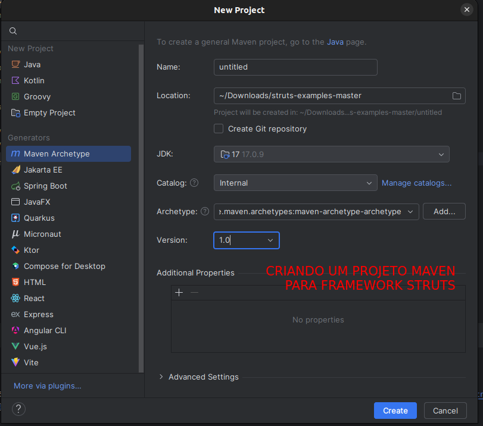

### How To Create A Struts 2 Web Application: [Documentação](https://struts.apache.org/getting-started/how-to-create-a-struts2-web-application)

* [x] Gerando um novo projeto Maven 



* [x] Adicionando as dependências necessárias

```xml
<?xml version="1.0"?>
<project
        xsi:schemaLocation="http://maven.apache.org/POM/4.0.0 http://maven.apache.org/xsd/maven-4.0.0.xsd"
        xmlns="http://maven.apache.org/POM/4.0.0" xmlns:xsi="http://www.w3.org/2001/XMLSchema-instance">
  <modelVersion>4.0.0</modelVersion>

  <groupId>org.apache.struts</groupId>
  <artifactId>helloworld</artifactId>
  <version>1.1.0</version>
  <name>Hello World Struts 2 Example Application</name>
  <description>Hello world example application for the Struts 2 Getting Started tutorials</description>

  <packaging>war</packaging>

  <properties>
    <struts2.version>2.5.20</struts2.version>
    <jetty-plugin.version>9.4.31.v20200723</jetty-plugin.version>
  </properties>

  <dependencies>
    <dependency>
      <groupId>org.apache.struts</groupId>
      <artifactId>struts2-core</artifactId>
      <version>${struts2.version}</version>
    </dependency>
  </dependencies>

  <build>
    <finalName>hello-world</finalName>
    <plugins>
      <plugin>
        <groupId>org.eclipse.jetty</groupId>
        <artifactId>jetty-maven-plugin</artifactId>
        <version>${jetty-plugin.version}</version>
        <configuration>
          <webApp>
            <contextPath>/${project.artifactId}</contextPath>
          </webApp>
          <stopKey>CTRL+C</stopKey>
          <stopPort>8999</stopPort>
          <scanIntervalSeconds>10</scanIntervalSeconds>
          <scanTargets>
            <scanTarget>src/main/webapp/WEB-INF/web.xml</scanTarget>
          </scanTargets>
        </configuration>
      </plugin>
    </plugins>
  </build>
</project>
```

* [x] rodando server jetty

```shell
  mvn jetty:run
```